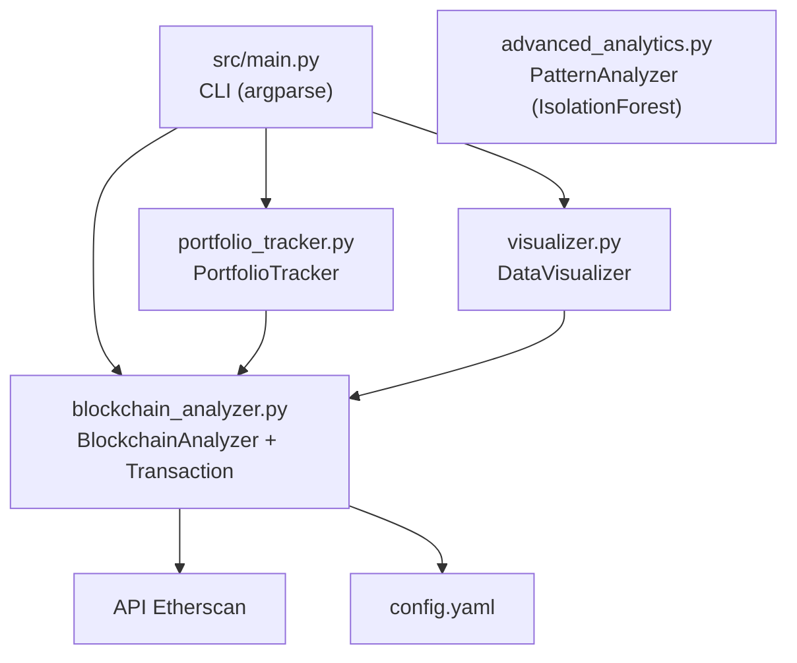

# Blockchain Analytics Platform

Plataforma de análise de dados blockchain Ethereum via API Etherscan. Permite consultar transações, saldos e histórico de endereços, rastrear portfolios, visualizar dados e detectar anomalias com IsolationForest.


---

## Índice / Table of Contents

- [Português](#português)
- [English](#english)

---

## Português

### Sobre o Projeto

Plataforma CLI para análise de blockchain Ethereum que integra a API do Etherscan para consultar dados on-chain. Oferece quatro módulos: análise de transações e endereços, rastreamento de portfolio, visualização de dados com matplotlib/seaborn e detecção de anomalias com IsolationForest.

### Arquitetura



### Funcionalidades

- **Análise de Transações**: consultar detalhes de transações por hash via Etherscan
- **Análise de Endereços**: consultar saldo e histórico de transações de endereços Ethereum
- **Rastreamento de Portfolio**: monitorar múltiplos endereços, consolidar saldos e contagem de transações
- **Visualização de Dados**: gráficos de evolução de preços, alocação de portfolio e volume de transações (matplotlib + seaborn)
- **Detecção de Anomalias**: identificar transações incomuns usando IsolationForest do scikit-learn

### Estrutura do Projeto

```
Blockchain-Analytics-Platform/
├── config.yaml              # Configuração da API Etherscan
├── requirements.txt         # Dependências Python
├── src/
│   ├── __init__.py           # Exportações do pacote
│   ├── main.py               # CLI principal (argparse)
│   ├── blockchain_analyzer.py # BlockchainAnalyzer + Transaction
│   ├── portfolio_tracker.py  # PortfolioTracker + Holding
│   ├── visualizer.py         # DataVisualizer (matplotlib/seaborn)
│   └── advanced_analytics.py # PatternAnalyzer (IsolationForest)
└── tests/
    ├── test_blockchain_analyzer.py
    ├── test_advanced_analytics.py
    ├── test_portfolio_tracker.py
    └── test_visualizer.py
```

### Pré-requisitos

- Python 3.8+
- Chave de API do [Etherscan](https://etherscan.io/apis)

### Instalação

```bash
git clone https://github.com/galafis/Blockchain-Analytics-Platform.git
cd Blockchain-Analytics-Platform
pip install -r requirements.txt
```

### Configuração

Edite `config.yaml` e insira sua chave de API do Etherscan:

```yaml
api_settings:
  etherscan_api_key: 'SUA_CHAVE_AQUI'
```

### Uso

```bash
# Analisar uma transação
python -m src.main --action analyze_tx --tx 0x<hash_da_transacao>

# Analisar um endereço (saldo + histórico)
python -m src.main --action analyze_address --address 0x<endereco_ethereum>

# Rastrear portfolio (endereços de exemplo hardcoded)
python -m src.main --action track_portfolio

# Gerar visualização de volume de transações
python -m src.main --action visualize_data
```

### Testes

```bash
python -m pytest tests/ -v
```

### Tecnologias

| Tecnologia | Uso |
|---|---|
| Python 3.8+ | Linguagem principal |
| requests | Requisições à API Etherscan |
| pandas | Manipulação de dados |
| matplotlib + seaborn | Visualização de dados |
| scikit-learn | Detecção de anomalias (IsolationForest) |
| PyYAML | Configuração |

---

## English

### About the Project

CLI platform for Ethereum blockchain analysis that integrates the Etherscan API for on-chain data queries. Provides four modules: transaction and address analysis, portfolio tracking, data visualization with matplotlib/seaborn, and anomaly detection with IsolationForest.

### Architecture


### Features

- **Transaction Analysis**: query transaction details by hash via Etherscan
- **Address Analysis**: query balance and transaction history of Ethereum addresses
- **Portfolio Tracking**: monitor multiple addresses, consolidate balances and transaction counts
- **Data Visualization**: price evolution charts, portfolio allocation pie charts, and transaction volume bar charts (matplotlib + seaborn)
- **Anomaly Detection**: identify unusual transactions using scikit-learn's IsolationForest

### Project Structure

```
Blockchain-Analytics-Platform/
├── config.yaml              # Etherscan API configuration
├── requirements.txt         # Python dependencies
├── src/
│   ├── __init__.py           # Package exports
│   ├── main.py               # Main CLI (argparse)
│   ├── blockchain_analyzer.py # BlockchainAnalyzer + Transaction
│   ├── portfolio_tracker.py  # PortfolioTracker + Holding
│   ├── visualizer.py         # DataVisualizer (matplotlib/seaborn)
│   └── advanced_analytics.py # PatternAnalyzer (IsolationForest)
└── tests/
    ├── test_blockchain_analyzer.py
    ├── test_advanced_analytics.py
    ├── test_portfolio_tracker.py
    └── test_visualizer.py
```

### Prerequisites

- Python 3.8+
- [Etherscan](https://etherscan.io/apis) API key

### Installation

```bash
git clone https://github.com/galafis/Blockchain-Analytics-Platform.git
cd Blockchain-Analytics-Platform
pip install -r requirements.txt
```

### Configuration

Edit `config.yaml` and insert your Etherscan API key:

```yaml
api_settings:
  etherscan_api_key: 'YOUR_KEY_HERE'
```

### Usage

```bash
# Analyze a transaction
python -m src.main --action analyze_tx --tx 0x<transaction_hash>

# Analyze an address (balance + history)
python -m src.main --action analyze_address --address 0x<ethereum_address>

# Track portfolio (hardcoded example addresses)
python -m src.main --action track_portfolio

# Generate transaction volume visualization
python -m src.main --action visualize_data
```

### Tests

```bash
python -m pytest tests/ -v
```

### Technologies

| Technology | Usage |
|---|---|
| Python 3.8+ | Main language |
| requests | Etherscan API requests |
| pandas | Data manipulation |
| matplotlib + seaborn | Data visualization |
| scikit-learn | Anomaly detection (IsolationForest) |
| PyYAML | Configuration |

---

## Licença / License

MIT License - veja [LICENSE](LICENSE) para detalhes / see [LICENSE](LICENSE) for details.
