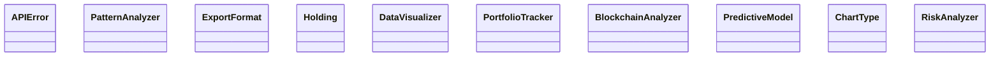

# 🤖 Blockchain Analytics Platform

> Professional repository showcasing advanced development skills

[](https://img.shields.io/badge/)
[](https://img.shields.io/badge/)
[](https://img.shields.io/badge/)
[](https://img.shields.io/badge/)
[](https://img.shields.io/badge/)
[](LICENSE)

[English](#english) | [Português](#português)

---

## English

### 🎯 Overview

**Blockchain Analytics Platform** is a production-grade Python application complemented by CSS, HTML that showcases modern software engineering practices including clean architecture, comprehensive testing, containerized deployment, and CI/CD readiness.

The codebase comprises **1,948 lines** of source code organized across **14 modules**, following industry best practices for maintainability, scalability, and code quality.

### ✨ Key Features

- **🤖 ML Pipeline**: End-to-end machine learning workflow from data to deployment
- **🔬 Feature Engineering**: Automated feature extraction and transformation
- **📊 Model Evaluation**: Comprehensive metrics and cross-validation
- **🚀 Model Serving**: Production-ready prediction API
- **📊 Interactive Visualizations**: Dynamic charts with real-time data updates
- **🎨 Responsive Design**: Adaptive layout for desktop and mobile devices
- **📈 Data Aggregation**: Multi-dimensional data analysis and filtering
- **📥 Export Capabilities**: PDF, CSV, and image export for reports

### 🏗️ Architecture

```mermaid
graph LR
    subgraph Input["📥 Input"]
        A[Raw Data]
        B[Feature Config]
    end
    
    subgraph Pipeline["🔬 ML Pipeline"]
        C[Preprocessing]
        D[Feature Engineering]
        E[Model Training]
        F[Evaluation]
    end
    
    subgraph Output["📤 Output"]
        G[Trained Models]
        H[Metrics & Reports]
        I[Predictions]
    end
    
    A --> C --> D --> E --> F
    B --> D
    F --> G
    F --> H
    G --> I
    
    style Input fill:#e1f5fe
    style Pipeline fill:#f3e5f5
    style Output fill:#e8f5e9
```





### 🚀 Quick Start

#### Prerequisites

- Python 3.12+
- pip (Python package manager)

#### Installation

```bash
# Clone the repository
git clone https://github.com/galafis/Blockchain-Analytics-Platform.git
cd Blockchain-Analytics-Platform

# Create and activate virtual environment
python -m venv venv
source venv/bin/activate  # On Windows: venv\Scripts\activate

# Install dependencies
pip install -r requirements.txt
```

#### Running

```bash
# Run the application
python main.py
```

### 🧪 Testing

```bash
# Run all tests
pytest

# Run with coverage report
pytest --cov --cov-report=html

# Run specific test module
pytest tests/test_main.py -v

# Run with detailed output
pytest -v --tb=short
```

### 📁 Project Structure

```
Blockchain-Analytics-Platform/
├── docs/          # Documentation
├── src/          # Source code
│   ├── __init__.py
│   ├── advanced_analytics.py
│   ├── blockchain_analyzer.py
│   ├── main.py
│   ├── portfolio_tracker.py
│   └── visualizer.py
├── tests/         # Test suite
│   ├── test_advanced_analytics.py
│   ├── test_blockchain_analyzer.py
│   ├── test_portfolio_tracker.py
│   └── test_visualizer.py
├── Dockerfile
├── LICENSE
├── README.md
├── config.yaml
├── main.py
└── requirements.txt
```

### 📊 Performance Metrics

The engine calculates comprehensive performance metrics:

| Metric | Description | Formula |
|--------|-------------|---------|
| **Sharpe Ratio** | Risk-adjusted return | (Rp - Rf) / σp |
| **Sortino Ratio** | Downside risk-adjusted return | (Rp - Rf) / σd |
| **Max Drawdown** | Maximum peak-to-trough decline | max(1 - Pt/Pmax) |
| **Win Rate** | Percentage of profitable trades | Wins / Total |
| **Profit Factor** | Gross profit / Gross loss | ΣProfit / ΣLoss |
| **Calmar Ratio** | Return / Max Drawdown | CAGR / MDD |
| **VaR (95%)** | Value at Risk | 5th percentile of returns |
| **Expected Shortfall** | Conditional VaR | E[R | R < VaR] |

### 🛠️ Tech Stack

| Technology | Description | Role |
|------------|-------------|------|
| **Python** | Core Language | Primary |
| **Docker** | Containerization platform | Framework |
| **NumPy** | Numerical computing | Framework |
| **Pandas** | Data manipulation library | Framework |
| **scikit-learn** | Machine learning library | Framework |
| HTML | 2 files | Supporting |
| CSS | 1 files | Supporting |

### 🤝 Contributing

Contributions are welcome! Please feel free to submit a Pull Request. For major changes, please open an issue first to discuss what you would like to change.

1. Fork the project
2. Create your feature branch (`git checkout -b feature/AmazingFeature`)
3. Commit your changes (`git commit -m 'Add some AmazingFeature'`)
4. Push to the branch (`git push origin feature/AmazingFeature`)
5. Open a Pull Request

### 📄 License

This project is licensed under the MIT License - see the [LICENSE](LICENSE) file for details.

### 👤 Author

**Gabriel Demetrios Lafis**
- GitHub: [@galafis](https://github.com/galafis)
- LinkedIn: [Gabriel Demetrios Lafis](https://linkedin.com/in/gabriel-demetrios-lafis)

---

## Português

### 🎯 Visão Geral

**Blockchain Analytics Platform** é uma aplicação Python de nível profissional, complementada por CSS, HTML que demonstra práticas modernas de engenharia de software, incluindo arquitetura limpa, testes abrangentes, implantação containerizada e prontidão para CI/CD.

A base de código compreende **1,948 linhas** de código-fonte organizadas em **14 módulos**, seguindo as melhores práticas do setor para manutenibilidade, escalabilidade e qualidade de código.

### ✨ Funcionalidades Principais

- **🤖 ML Pipeline**: End-to-end machine learning workflow from data to deployment
- **🔬 Feature Engineering**: Automated feature extraction and transformation
- **📊 Model Evaluation**: Comprehensive metrics and cross-validation
- **🚀 Model Serving**: Production-ready prediction API
- **📊 Interactive Visualizations**: Dynamic charts with real-time data updates
- **🎨 Responsive Design**: Adaptive layout for desktop and mobile devices
- **📈 Data Aggregation**: Multi-dimensional data analysis and filtering
- **📥 Export Capabilities**: PDF, CSV, and image export for reports

### 🏗️ Arquitetura


### 🚀 Início Rápido

#### Prerequisites

- Python 3.12+
- pip (Python package manager)

#### Installation

```bash
# Clone the repository
git clone https://github.com/galafis/Blockchain-Analytics-Platform.git
cd Blockchain-Analytics-Platform

# Create and activate virtual environment
python -m venv venv
source venv/bin/activate  # On Windows: venv\Scripts\activate

# Install dependencies
pip install -r requirements.txt
```

#### Running

```bash
# Run the application
python main.py
```

### 🧪 Testing

```bash
# Run all tests
pytest

# Run with coverage report
pytest --cov --cov-report=html

# Run specific test module
pytest tests/test_main.py -v

# Run with detailed output
pytest -v --tb=short
```

### 📁 Estrutura do Projeto

```
Blockchain-Analytics-Platform/
├── docs/          # Documentation
├── src/          # Source code
│   ├── __init__.py
│   ├── advanced_analytics.py
│   ├── blockchain_analyzer.py
│   ├── main.py
│   ├── portfolio_tracker.py
│   └── visualizer.py
├── tests/         # Test suite
│   ├── test_advanced_analytics.py
│   ├── test_blockchain_analyzer.py
│   ├── test_portfolio_tracker.py
│   └── test_visualizer.py
├── Dockerfile
├── LICENSE
├── README.md
├── config.yaml
├── main.py
└── requirements.txt
```

### 📊 Performance Metrics

The engine calculates comprehensive performance metrics:

| Metric | Description | Formula |
|--------|-------------|---------|
| **Sharpe Ratio** | Risk-adjusted return | (Rp - Rf) / σp |
| **Sortino Ratio** | Downside risk-adjusted return | (Rp - Rf) / σd |
| **Max Drawdown** | Maximum peak-to-trough decline | max(1 - Pt/Pmax) |
| **Win Rate** | Percentage of profitable trades | Wins / Total |
| **Profit Factor** | Gross profit / Gross loss | ΣProfit / ΣLoss |
| **Calmar Ratio** | Return / Max Drawdown | CAGR / MDD |
| **VaR (95%)** | Value at Risk | 5th percentile of returns |
| **Expected Shortfall** | Conditional VaR | E[R | R < VaR] |

### 🛠️ Stack Tecnológica

| Tecnologia | Descrição | Papel |
|------------|-----------|-------|
| **Python** | Core Language | Primary |
| **Docker** | Containerization platform | Framework |
| **NumPy** | Numerical computing | Framework |
| **Pandas** | Data manipulation library | Framework |
| **scikit-learn** | Machine learning library | Framework |
| HTML | 2 files | Supporting |
| CSS | 1 files | Supporting |

### 🤝 Contribuindo

Contribuições são bem-vindas! Sinta-se à vontade para enviar um Pull Request.

### 📄 Licença

Este projeto está licenciado sob a Licença MIT - veja o arquivo [LICENSE](LICENSE) para detalhes.

### 👤 Autor

**Gabriel Demetrios Lafis**
- GitHub: [@galafis](https://github.com/galafis)
- LinkedIn: [Gabriel Demetrios Lafis](https://linkedin.com/in/gabriel-demetrios-lafis)
